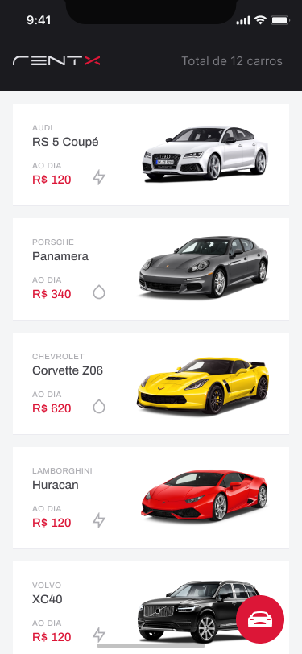

# RentX - Mobile

<p align="center"></p>

> **Info**: Projeto desenvolvido durante as aulas do Chapter III do Ignite - Trilha React Native onde foi desenvolvida uma esta aplicação com funcionalidades de visualização de veículos disponíveis e agendamento.
---
<br>

<p align="center">
  <a href="#-telas-da-aplicação">Telas</a>&nbsp;&nbsp;&nbsp;|&nbsp;&nbsp;&nbsp;
  <a href="#-informações-do-projeto">Informações</a>&nbsp;&nbsp;&nbsp;|&nbsp;&nbsp;&nbsp;
  <a href="#-tecnologias-e-ferramentas-usadas">Tecnologias</a>&nbsp;&nbsp;&nbsp;|&nbsp;&nbsp;&nbsp;
  <a href="#-clonando-o-projeto-para-sua-máquina">Clonar</a>&nbsp;&nbsp;&nbsp;
  |&nbsp;&nbsp;&nbsp;
  <a href="#-como-executar-o-projeto-em-seu-celular-ou-emulador-usando-o-expo">Executando</a>&nbsp;&nbsp;&nbsp;|&nbsp;&nbsp;&nbsp;
  <a href="#-dúvidas">Dúvidas</a>&nbsp;&nbsp;&nbsp;|&nbsp;&nbsp;&nbsp;
  <a href="#-licença-mit">Licença</a>
</p>

---
<br/>
<br>
<br>

# 📱 Telas da aplicação

> <p>

</p>

<br>
<br>

# 👽 Informações do projeto

- Você pode acessar o layout do [**projeto no Figma** aqui](https://www.figma.com/file/4ojyGi2mGuQaGK0sUHMAqB/RentX-Ignite?node-id=0%3A1).
- Você pode acessar o Código fonte do [**projeto no github** aqui](https://github.com/andrelinos/rentx).

<br>
<br>

# 🏇 Tecnologias e ferramentas usadas

- [React Native](https://reactnative.dev/)
- [Expo](https://expo.dev/)
- [Axios](https://axios-http.com/)
- [Styled-components](https://styled-components.com/)
- [TypeScript](https://www.typescriptlang.org/)
- [Babel](https://babeljs.io/)
- [Google Fontes](https://fonts.google.com/)
- [Date-fns](https://date-fns.org/)
- [LottieFiles](https://lottiefiles.com/)
- [React Native Calendars](https://github.com/wix/react-native-calendars#readme)

<br>
<br>

# 💻 Clonando o projeto para sua máquina

1. Abra o terminal de seu computador.
2. Acessar a pasta de seus projetos.
3. Estando dentro da pasta de seus projetos, execute os comandos abaixo para clonar o projeto online:

```bash
# Para fazer o download do projeto para seu computador
$ git clone https://github.com/andrelinos/rentx.git

# Entrar na pasta do projeto 
$ cd rentx

# Para baixar as dependências do projeto
$ yarn

# Abra com o editor vscode
$ code .
```

4. Pronto, agora basta testar e fazer as alterações que desejar.
  
<br>
<br>

# 🔥 Como executar o projeto em seu celular ou emulador usando o expo

1. Dentro da pasta da aplicação pelo terminal, execute o comando abaixo

```bash
# Este comando serve os dados para a aplicação em seu dispositivo físico ou emulador 

$ yarn start:api 

# Nota: este comando pode ser alterado dentro do arquivo package.json caso queira
```

2. Em seguida, abra uma nova janela do terminal e execute o comando abaixo:

```bash
# Este comando disponibilizar o projeto para ser aberto pelo aplicativo expo Go que você deve ter instalado em seu dispositivo físico ou no emulador. 

$ expo start

```

3. Em seguida, com o aplicativo **Expo Go** instalado em seu smartphone, basta ler o QRCode que aparece na tela do computador.

<br>

> **Nota**:
>
> 1. Seu celular e o computador devem estar na mesma rede wi-fi e na mesma faixa de IP para que funcione o aplicativo entre seu computador e seu celular.
> 2. Você precisa definir o IP de sua máquina onde está rodando a API do projeto no arquivo `services>api.ts` na opção `baseURL` (ex: baseURL: 'http://IP-COMPUTADOR:3333').
>
> _

<br>
<br>

# 😅 Dúvidas

Se você tive alguma dúvida, poderá entrar em contato comigo aqui [andrelino.dev](https://andrelino.dev).

<br>
<br>

## 📄 Licença MIT

- Consulte a [LICENÇA](LICENSE) para mais informações.
<br>
<br>

<p align="center"></p>
<br>
<br>

---
<p align="center"> Made with 💜 by <a href="https://github.com/andrelinos"> Andrelino Silva </a></p>
